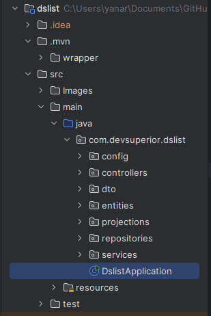
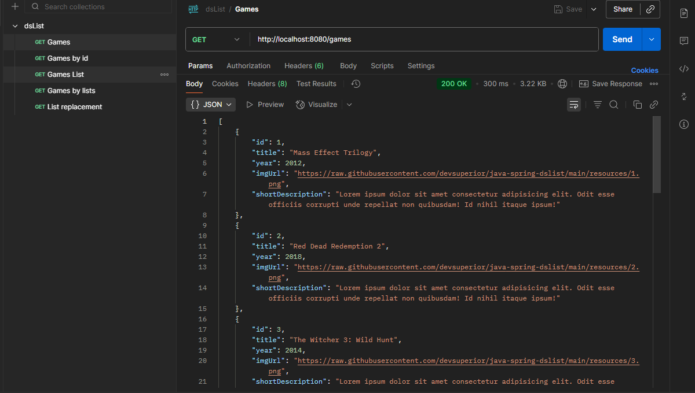
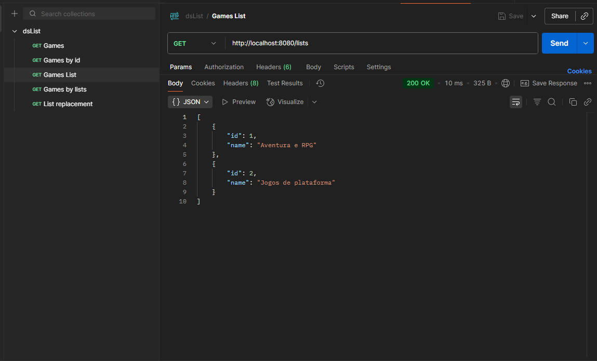

# DSList - Gerenciador de Coleções Backend

  
  

Este projeto é um sistema backend desenvolvido em **Java** utilizando **Spring Boot**, com persistência de dados no **PostgreSQL**. O projeto foi desenvolvido no curso intensão java ministrado pelo @acenelio com base no projeto: https://github.com/devsuperior/dslist-backend. O desenvolvimento teve como objetivo relembrar conceitos de java e me manter atualizado nessa linguagem de programação.

## 📚 Estrutura do projeto

### Conceitos utilizados

- Padrão em camadas:
  - **Controller**, **Service**, **Repository**
- Sistemas web e recursos
- Cliente/servidor, HTTP e JSON
- Padrão REST para APIs web
- Estruturação de projeto Spring REST
- Database seeding
- Relacionamentos N-N
- Consultas SQL no Spring Data JPA
- Processo de homologação local
- Processo de deploy com CI/CD
- Configuração de CORS

---

### Padrão DTO

  

## 🚀 Tecnologias Utilizadas
- **Java 17**
- **Spring Boot**
- **Maven**
- **PostgreSQL**
- **Docker Compose** (para configuração local)
- Ferramentas de CI/CD para deploy automatizado

## 🌐 **Funcionalidades**
1. **Consulta de coleções**.  
2. **Listagem de coleções organizados por categorias**.  
3. **Consulta personalizada com Projections**.  
4. **Deploy em produção com CI/CD**.  
5. **Configuração de CORS para acesso seguro na web**.

## 🛠️ Como Executar o Projeto

### Pré-requisitos
- **Java 17**
- Banco de dados **PostgreSQL**
- (Opcional) **Docker** para rodar containers

API Desenvolvida conta com 5 rotas funcionais (Com coleção para Games): 

Games:

Game Lists: 

Game by lists:

